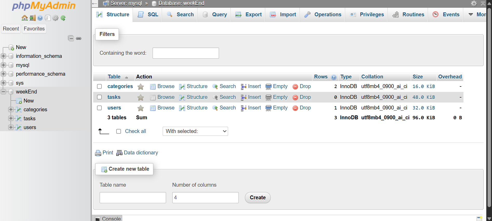

# 🐳 PHP + MySQL Task Manager (Mini Project)

This is a small project demonstrating how to run a PHP application with MySQL and phpMyAdmin using Docker. It's a basic setup that could serve as a starting point for a task management app or other CRUD-based projects.

## 📦 Technologies Used

- PHP 8.2 (Apache)
- MySQL 8.0
- phpMyAdmin
- Docker & Docker Compose

## 📁 Project Structure

project-root/
│
├── app/                   # PHP application code  
├── Dockerfile             # PHP image with pdo_mysql  
└── docker-compose.yaml    # Multi-container setup

## ⚙️ Setup Instructions

1. Clone the repository
```bash
git clone https://github.com/makombelajob/request_advanced.git
cd request_advanced
